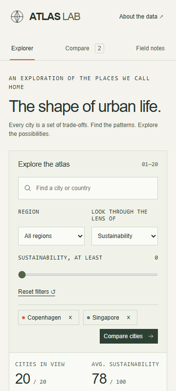

# Atlas Lab

An interactive urban observatory for exploring the trade-offs between mobility, sustainability, cost and everyday city life.

## Key features

- Twenty locally defined city scenarios, five regions and six indicators.
- Search, region and sustainability filters update the map, cards, metrics and CSV export.
- Keyboard-interactive schematic map, scatterplot, city profiles and metric sorting.
- Comparison of up to three cities with radar plot and accessible data table.
- Field notes open comparisons; methodology explains units, averages and scenario assumptions.
- No API keys, external data requests or backend required.

## Technology

React 19, Vite, native SVG charts, JavaScript, CSS, ESLint, Prettier and Playwright.

## Local development

Requires Node.js 24 and npm.

~~~bash
npm ci
npm run dev
~~~

Open the local URL printed by Vite. There are no demo accounts or runtime secrets for this frontend-only project.

## Configuration

See .env.example. BASE_PATH is passed as an environment variable to Vite. Local builds default to ./ so assets remain relative. Repository Pages builds use /prfio-atlas-lab/.

~~~bash
npm run lint
npm run build
npm run preview
~~~

## Testing

~~~bash
npx playwright install chromium
npm test
~~~

Playwright starts a server on port 5196 and checks interactions, validation responsive layouts and automated axe accessibility checks. Captures go to docs/screenshots. See [QA.md](QA.md) for execution evidence. CI runs the suite before publishing.

## Deployment

The included GitHub Actions workflow validates, builds with the repository base path, uploads dist and deploys through GitHub Pages. Set **Settings → Pages → Source → GitHub Actions**, then push main or run the workflow manually. No live URL is claimed until publication succeeds.

~~~bash
gh auth login
gh repo create prfio-atlas-lab --public --source=. --remote=origin --push
gh api --method POST repos/{owner}/prfio-atlas-lab/pages -f build_type=workflow
gh workflow run pages.yml
~~~

Replace {owner} with your GitHub login. If a remote exists, inspect it first; never force-push unrelated history. Description and topics are in .github/repository.json.

## Architecture and structure

~~~text
src/                 Application logic, styles and local data
public/              Local media, icons and credits page
index.html           Entry document
vite.config.js       Build and repository base configuration
tests/               Browser and domain checks
docs/screenshots/    Running application captures
.github/workflows/   Validation and Pages deployment
~~~

Product-specific modules own UI behaviour. Static media stays local. data.js owns records and transforms; Charts.jsx owns SVG visualizations; main.jsx coordinates explorer, comparison, notes and profile views.

## Scope and limits

Indicator values are illustrative scenarios, not official statistics or a ranking. Population boundaries are not standardised. The interface documents these limits and calculates no composite score. Comparisons and filters reset on reload.

## Design and credits

[DESIGN.md](DESIGN.md) records the visual system. [CREDITS.md](CREDITS.md) records research, media and icon provenance. MIT-licensed source; dependencies retain their original licences.
