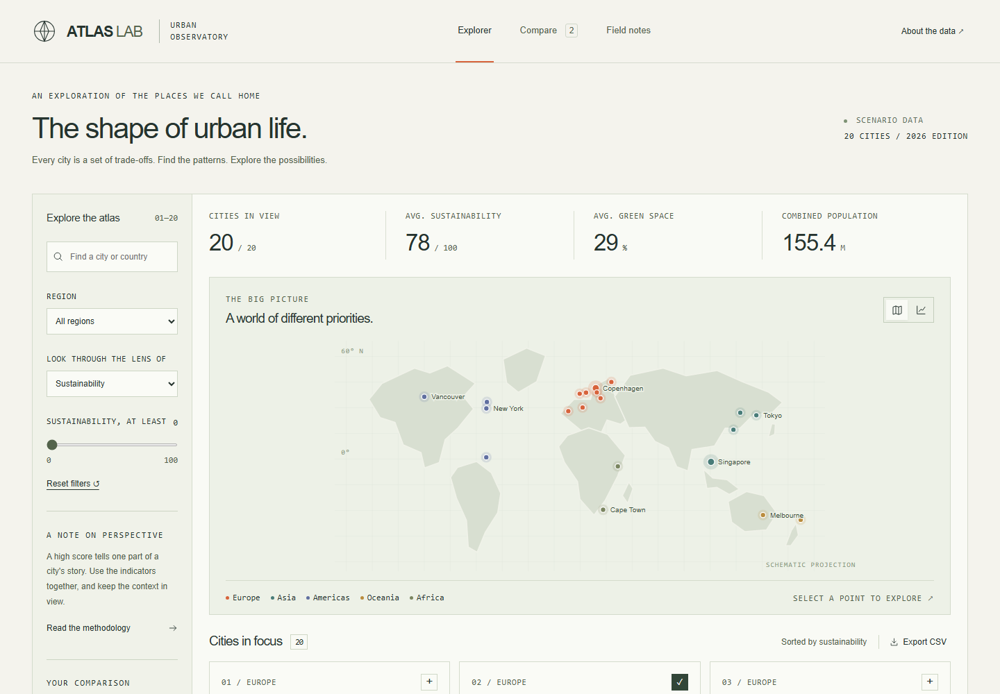
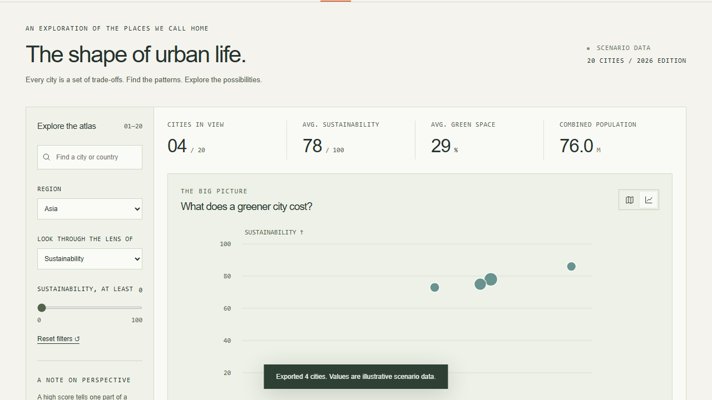
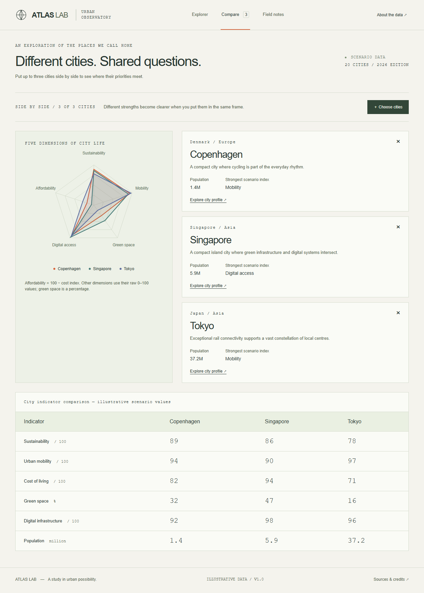
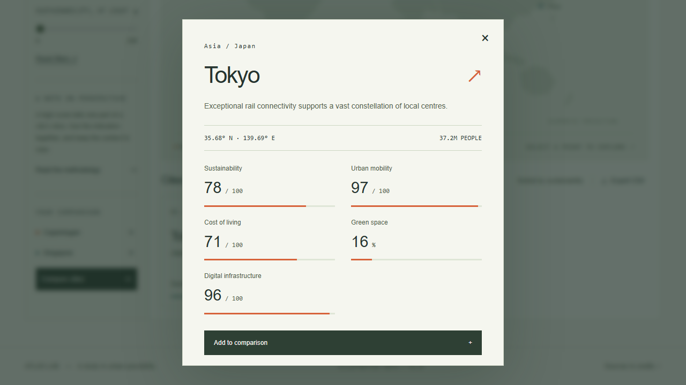

# Atlas Lab

An interactive urban observatory for exploring how mobility, sustainability, cost, green space and digital infrastructure vary across a small set of city scenarios.



Atlas Lab is a frontend data-visualization project rather than a statistical ranking product. Its 20 city records are deliberately authored **illustrative scenarios**: the interface is designed to explore relationships and trade-offs, not to present the values as official city statistics.

## Explore the dataset

The main explorer combines several views over the same local dataset:

- search by city or country;
- filter by region and minimum sustainability value;
- sort the city list by an indicator;
- inspect cities on a keyboard-interactive schematic map;
- switch scatterplot dimensions;
- open a city profile;
- export the current filtered rows as CSV;
- compare up to three cities side by side.

Filters update the map, cards, summary values and export together, so each view represents the same current subset.



## Indicators

Each city contains six comparable fields:

| Indicator | Meaning in Atlas Lab |
| --- | --- |
| Sustainability | Scenario index for resource use, energy and environmental planning; higher is better. |
| Urban mobility | Scenario index for transit, walking and cycling access; higher is better. |
| Cost of living | Relative cost index with the New York scenario set to 100; higher means more expensive. |
| Green space | Illustrative percentage of urban land allocated to public green space. |
| Digital infrastructure | Scenario index for connectivity and digital public services; higher is better. |
| Population | Illustrative urban-area population in millions; city boundaries are not standardised. |

The project deliberately does **not** calculate a composite city score. Indicators have different meanings and directions, and reducing them to a single rank would imply a methodology the dataset does not support.

See [METHODOLOGY.md](METHODOLOGY.md) for interpretation rules and [DATA.md](DATA.md) for the record schema and transformations.

## Comparing cities

The comparison workspace accepts up to three cities and renders the selected indicators as a radar plot together with a data table.



The radar visualization is intended as a shape comparison, not as an overall score. Population is not part of the radar scale; the indexed indicators and green-space percentage are already expressed on 0–100-like ranges, while population has a different unit and magnitude.

The accompanying table is the precise representation of the values and remains available without relying on the chart geometry.

## City profiles and field notes

City cards and map markers open profiles with the local description and indicator values. Field notes provide editorial entry points into particular comparisons without changing the underlying dataset.



The map itself is schematic. Coordinates locate city centres for the projection, but the rendered land geometry is an interface device rather than a geographic reference map.

## Visualization implementation

Atlas Lab uses React 19, Vite and native SVG rather than a charting framework. `src/Charts.jsx` owns the map, scatterplot and radar rendering; `src/data.js` owns the city records, indicator metadata, filtering, means and CSV serialization; the application layer coordinates filters, profiles, comparison and notes.

Keeping the visualizations local makes their scales, interaction states and accessible alternatives explicit in the project code.

## Accessibility

Data visualization introduces interaction requirements beyond ordinary cards and forms. Atlas Lab therefore provides keyboard-operable map/chart controls, visible focus states, semantic form controls and text/table alternatives where exact chart values matter.

The responsive interface has been exercised at 360, 768, 1440 and 2560 pixel widths, and the browser suite includes automated axe checks. Automated scanning is useful regression coverage, not a claim of complete accessibility conformance.

Implementation notes are collected in [ACCESSIBILITY.md](ACCESSIBILITY.md).

## Run locally

Requires Node.js 24 and npm.

```bash
npm ci
npm run dev
```

There is no backend, API key, account or runtime data service. All scenario data ships with the frontend.

Production build:

```bash
npm run lint
npm run build
npm run preview
```

`BASE_PATH` can override the Vite base path. Local builds default to relative assets; the repository workflow supplies the GitHub Pages repository path when publishing.

## Tests

```bash
npx playwright install chromium
npm test
```

The Playwright suite covers dataset bounds, combined filters, empty/reset states, profiles, the three-city comparison limit, comparison table values, field-note navigation, CSV export, scatterplot switching, responsive layouts, keyboard interaction and automated accessibility checks.

GitHub Actions runs validation before the Pages build. Screenshots in `docs/screenshots` are captures from the running application rather than static mockups.

## Project structure

```text
src/
  data.js             Scenario records, indicators and data transforms
  Charts.jsx          Native SVG map, scatterplot and radar
  main.jsx            Explorer, profiles, comparison and notes
  styles.css          Application visual system
public/               Local interface assets
tests/                Browser and interaction coverage
docs/screenshots/     Captures from the running application
.github/workflows/    Validation and Pages publishing
```

## Data boundaries

The values in this repository are illustrative and should not be quoted as factual measurements of the named cities. Population boundaries are not standardised, indices are scenario values, and the project does not establish causal relationships between indicators.

The useful output of Atlas Lab is the **interaction and visualization model**: filtering a coherent dataset, inspecting dimensions, comparing records and exposing assumptions alongside the graphics.

## Documentation

- [Methodology](METHODOLOGY.md) — how to interpret the indicators and comparisons.
- [Data reference](DATA.md) — schema, ranges, filters, means and CSV export.
- [Accessibility](ACCESSIBILITY.md) — keyboard interaction and non-visual chart alternatives.

MIT licensed; dependencies retain their upstream licenses.